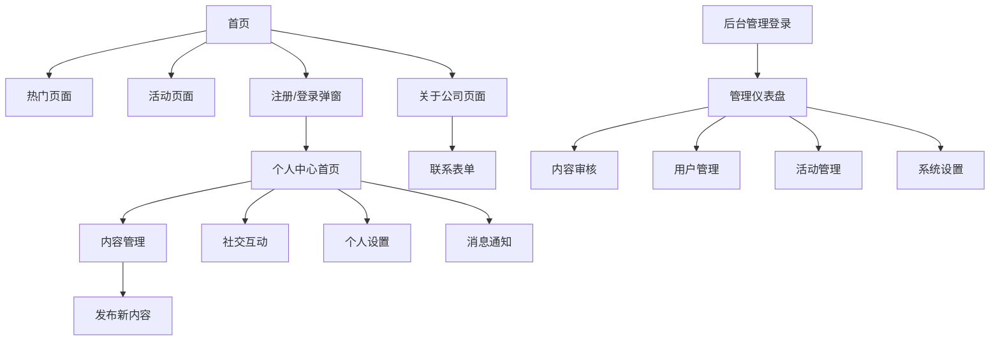

# Biubiustar社交媒体平台产品需求文档

## 1. 产品概述

Biubiustar社交媒体平台是一个基于前后台分离架构的现代化社交媒体平台，致力于为用户提供优质的内容分享和社交互动体验。平台采用简洁大气的毛玻璃设计风格，以紫色为主题色，支持多语言（越南语、英语、中文简体、中文繁体），为全球用户提供无障碍的社交体验。

平台主要解决用户内容分享、社交互动、活动参与等需求，目标成为东南亚地区领先的社交媒体平台，服务于个人用户、内容创作者和企业合作伙伴。

## 2. 核心功能

### 2.1 用户角色

| 角色    | 注册方式       | 核心权限                  |
| ----- | ---------- | --------------------- |
| 普通用户  | 邮箱注册，无需验证码 | 浏览内容、发布内容、社交互动、个人中心管理 |
| 管理员   | 超级管理员创建    | 内容审核、用户管理、活动管理、系统设置   |
| 超级管理员 | 系统预设       | 全部管理权限、管理员账号创建        |

### 2.2 功能模块

本平台包含以下核心页面：

1. **首页**：品牌展示、热门内容展示、活动推荐、社区邀请
2. **热门页面**：热门内容列表、筛选功能、无限滚动加载
3. **活动页面**：活动列表、活动详情、参与功能
4. **关于公司页面**：企业介绍、发展历程、合作伙伴、联系表单
5. **用户个人中心**：个人概览、内容管理、社交互动、个人设置、消息通知
6. **后台管理系统**：仪表盘、内容管理、用户管理、活动管理、系统设置

### 2.3 页面详情

| 页面名称 | 模块名称  | 功能描述                    |
| ---- | ----- | ----------------------- |
| 首页   | 导航栏   | 网站导航菜单、语言切换、用户登录状态显示    |
| 首页   | 品牌展示区 | Biubiustar品牌标识、核心价值主张展示 |
| 首页   | 热门内容区 | 精选优质帖子网格展示、互动数据显示       |
| 首页   | 活动推荐区 | 重要活动大尺寸卡片展示、参与引导        |
| 首页   | 社区邀请区 | 注册引导、联系合作入口             |
| 热门页面 | 内容列表  | 按互动量排序展示内容、实时更新         |
| 热门页面 | 筛选功能  | 按时间段、内容类型筛选             |
| 活动页面 | 活动列表  | 按时间顺序展示活动、分类显示          |
| 活动页面 | 活动详情  | 活动信息、参与方式、图片视频展示        |
| 关于公司 | 企业介绍  | 公司简介、企业概况、发展战略          |
| 关于公司 | 发展时间轴 | 公司发展历程、重要里程碑            |
| 关于公司 | 业绩展示  | 2024年业绩数据、增长趋势          |
| 关于公司 | 合作伙伴  | 合作伙伴LOGO展示、合作详情         |
| 关于公司 | 联系表单  | 合作类目选择、联系信息收集           |
| 个人中心 | 个人概览  | 头像昵称、统计数据、快速操作          |
| 个人中心 | 内容管理  | 发布内容列表、草稿箱、新内容发布        |
| 个人中心 | 社交互动  | 点赞评论历史、关注管理、互动通知        |
| 个人中心 | 个人设置  | 基础信息、隐私设置、账户安全          |
| 个人中心 | 消息通知  | 系统通知、互动通知、活动通知          |
| 后台管理 | 仪表盘   | 关键数据展示、快速操作入口           |
| 后台管理 | 内容管理  | 内容审核、已发布内容管理、分类管理       |
| 后台管理 | 用户管理  | 用户信息管理、行为监控、批量操作        |
| 后台管理 | 活动管理  | 活动发布、数据统计、效果分析          |
| 后台管理 | 系统设置  | 多语言管理、网站信息、系统参数         |
| 认证系统 | 注册弹窗  | 用户名邮箱密码注册、即时可用          |
| 认证系统 | 登录弹窗  | 用户名/邮箱登录、记住状态           |
| 认证系统 | 忘记密码  | 邮箱重置密码流程                |

## 3. 核心流程

### 普通用户流程

用户访问首页浏览内容 → 点击注册按钮打开注册弹窗 → 填写用户名、邮箱、密码完成注册 → 自动登录进入个人中心 → 发布内容或参与社交互动 → 查看消息通知和个人数据统计

### 管理员流程

管理员独立登录后台系统 → 查看仪表盘数据概览 → 处理待审核内容 → 管理用户账户和权限 → 发布和管理活动 → 配置系统设置和多语言内容

### 内容发布流程

用户登录后进入个人中心 → 点击发布新内容 → 使用富文本编辑器编辑内容 → 上传图片或视频 → 选择标签 → 提交审核 → 管理员审核通过后公开展示

## 4. 用户界面设计

### 4.1 设计风格

* **主色调**：紫色系（#8B5CF6主色、#A855F7辅助色、#C084FC浅色）

* **辅助色**：中性灰色系（#F8F9FA、#E9ECEF、#6C757D）、纯白色（#FFFFFF）

* **功能色**：成功绿（#28A745）、警告橙（#FFC107）、错误红（#DC3545）

* **按钮风格**：毛玻璃效果，适度圆角（8px），柔和阴影

* **字体**：大标题32px、中标题24px、小标题18px、正文16px、辅助文字14px

* **布局风格**：大气卡片布局，统一间距，毛玻璃效果容器

* **图标风格**：简洁线性图标，与整体风格保持一致

### 4.2 页面设计概览

| 页面名称 | 模块名称  | UI元素                                |
| ---- | ----- | ----------------------------------- |
| 首页   | 导航栏   | 毛玻璃效果背景，半透明紫色调，简洁菜单项，语言切换器          |
| 首页   | 品牌展示区 | 大尺寸品牌标识，毛玻璃卡片容器，极简边框，居中布局           |
| 首页   | 热门内容区 | 网格布局卡片，统一尺寸比例，极简数据标签，毛玻璃效果          |
| 首页   | 活动推荐区 | 大尺寸活动卡片，层次分明标题，简约参与按钮               |
| 首页   | 社区邀请区 | 大字体邀请标题，半透明背景，紫色主题按钮，简洁边框次要按钮       |
| 认证弹窗 | 注册/登录 | 大尺寸弹窗（560px宽），毛玻璃背景模糊，极简表单设计，优雅关闭按钮 |
| 个人中心 | 概览面板  | 统计数据卡片，毛玻璃效果，简洁图标，清晰数据展示            |
| 个人中心 | 内容管理  | 列表式布局，状态标签，操作按钮组，富文本编辑器             |
| 后台管理 | 仪表盘   | 数据可视化图表，快速操作卡片，统一的管理界面风格            |
| 后台管理 | 审核中心  | 内容预览卡片，审核操作按钮，批量操作工具栏               |

### 4.3 响应式设计

平台采用移动优先的响应式设计策略：

* **桌面端**（1200px+）：完整功能展示，多列布局

* **平板端**（768px-1199px）：适配式布局，保持核心功能

* **移动端**（<768px）：单列布局，触摸友好，简化操作

* 所有设备均保持毛玻璃效果和紫色主题的一致性

* 弹窗在移动端占屏幕95%宽度，保持良好的用户体验

