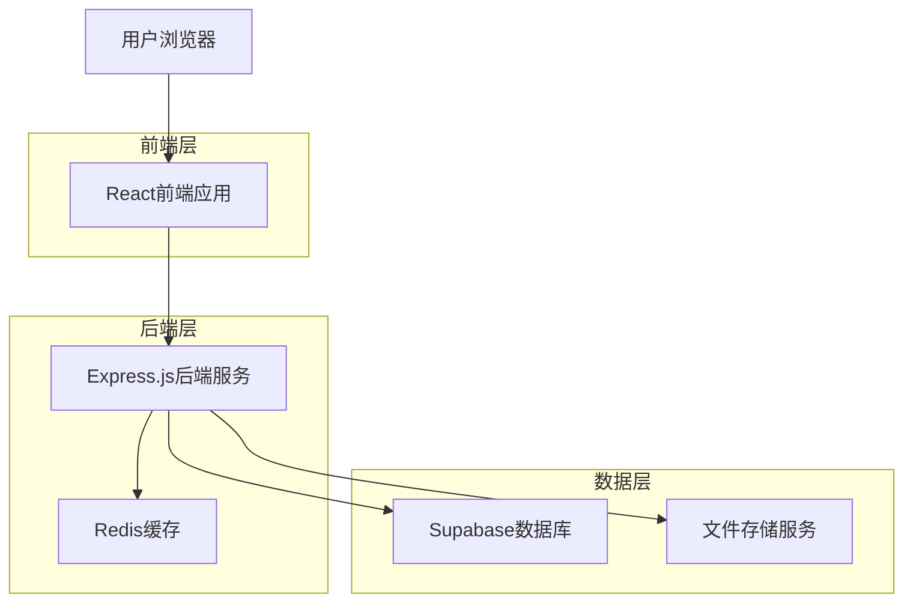
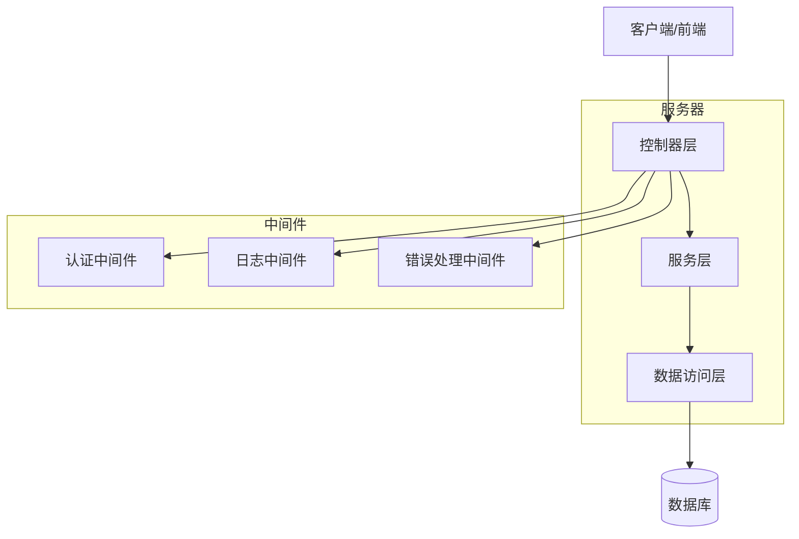
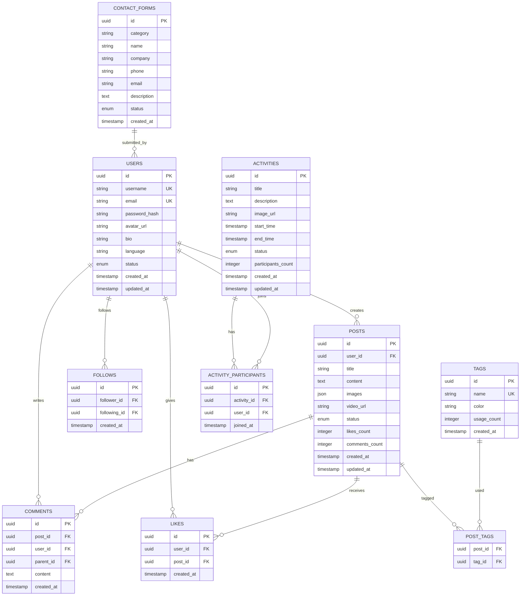

# Biubiustar社交媒体平台技术架构文档

## 1. 架构设计



## 2. 技术描述

- **前端**: React@18 + TypeScript + TailwindCSS@3 + Vite + React Router + React Query
- **后端**: Express.js@4 + TypeScript + JWT认证 + Multer文件上传
- **数据库**: Supabase (PostgreSQL)
- **缓存**: Redis@7
- **文件存储**: Supabase Storage
- **部署**: Docker + Nginx

## 3. 路由定义

| 路由 | 用途 |
|------|------|
| / | 首页，展示品牌信息、热门内容、活动推荐 |
| /hot | 热门页面，展示热门内容列表和筛选功能 |
| /activities | 活动页面，展示活动列表和详情 |
| /about | 关于公司页面，企业介绍和联系表单 |
| /profile | 个人中心首页，用户概览和快速操作 |
| /profile/content | 内容管理页面，发布内容和草稿管理 |
| /profile/social | 社交互动页面，点赞评论和关注管理 |
| /profile/settings | 个人设置页面，基础信息和隐私设置 |
| /profile/notifications | 消息通知页面，系统和互动通知 |
| /admin | 后台管理登录页面 |
| /admin/dashboard | 管理仪表盘，数据概览和快速操作 |
| /admin/content | 内容管理，审核和已发布内容管理 |
| /admin/users | 用户管理，用户信息和行为监控 |
| /admin/activities | 活动管理，活动发布和数据统计 |
| /admin/settings | 系统设置，多语言和网站配置 |

## 4. API定义

### 4.1 用户认证相关

**用户注册**
```
POST /api/auth/register
```

请求参数:
| 参数名 | 参数类型 | 是否必填 | 描述 |
|--------|----------|----------|------|
| username | string | true | 用户名，3-20个字符 |
| email | string | true | 邮箱地址 |
| password | string | true | 密码，8位以上包含字母数字 |

响应参数:
| 参数名 | 参数类型 | 描述 |
|--------|----------|------|
| success | boolean | 注册是否成功 |
| token | string | JWT认证令牌 |
| user | object | 用户基本信息 |

示例:
```json
{
  "username": "testuser",
  "email": "test@example.com",
  "password": "password123"
}
```

**用户登录**
```
POST /api/auth/login
```

请求参数:
| 参数名 | 参数类型 | 是否必填 | 描述 |
|--------|----------|----------|------|
| account | string | true | 用户名或邮箱 |
| password | string | true | 密码 |

响应参数:
| 参数名 | 参数类型 | 描述 |
|--------|----------|------|
| success | boolean | 登录是否成功 |
| token | string | JWT认证令牌 |
| user | object | 用户信息 |

### 4.2 内容管理相关

**获取内容列表**
```
GET /api/content
```

请求参数:
| 参数名 | 参数类型 | 是否必填 | 描述 |
|--------|----------|----------|------|
| page | number | false | 页码，默认1 |
| limit | number | false | 每页数量，默认20 |
| type | string | false | 内容类型筛选 |
| sort | string | false | 排序方式（hot/new/top） |

**发布内容**
```
POST /api/content
```

请求参数:
| 参数名 | 参数类型 | 是否必填 | 描述 |
|--------|----------|----------|------|
| title | string | true | 内容标题 |
| content | string | true | 内容正文 |
| tags | array | false | 标签数组 |
| images | array | false | 图片URL数组 |
| video | string | false | 视频URL |

### 4.3 社交互动相关

**点赞/取消点赞**
```
POST /api/content/:id/like
```

**发表评论**
```
POST /api/content/:id/comment
```

请求参数:
| 参数名 | 参数类型 | 是否必填 | 描述 |
|--------|----------|----------|------|
| content | string | true | 评论内容 |
| parent_id | number | false | 父评论ID（回复评论时） |

**关注用户**
```
POST /api/users/:id/follow
```

### 4.4 活动管理相关

**获取活动列表**
```
GET /api/activities
```

**活动报名**
```
POST /api/activities/:id/join
```

### 4.5 联系表单相关

**提交联系表单**
```
POST /api/contact
```

请求参数:
| 参数名 | 参数类型 | 是否必填 | 描述 |
|--------|----------|----------|------|
| category | string | true | 合作类目 |
| name | string | true | 姓名 |
| company | string | false | 公司名称 |
| phone | string | true | 联系电话 |
| email | string | true | 邮箱地址 |
| description | string | false | 合作描述 |

## 5. 服务器架构图



## 6. 数据模型

### 6.1 数据模型定义



### 6.2 数据定义语言

**用户表 (users)**
```sql
-- 创建用户表
CREATE TABLE users (
    id UUID PRIMARY KEY DEFAULT gen_random_uuid(),
    username VARCHAR(50) UNIQUE NOT NULL,
    email VARCHAR(255) UNIQUE NOT NULL,
    password_hash VARCHAR(255) NOT NULL,
    avatar_url TEXT,
    bio TEXT,
    language VARCHAR(10) DEFAULT 'vi',
    status VARCHAR(20) DEFAULT 'active' CHECK (status IN ('active', 'inactive', 'banned')),
    created_at TIMESTAMP WITH TIME ZONE DEFAULT NOW(),
    updated_at TIMESTAMP WITH TIME ZONE DEFAULT NOW()
);

-- 创建索引
CREATE INDEX idx_users_username ON users(username);
CREATE INDEX idx_users_email ON users(email);
CREATE INDEX idx_users_status ON users(status);
```

**内容表 (posts)**
```sql
-- 创建内容表
CREATE TABLE posts (
    id UUID PRIMARY KEY DEFAULT gen_random_uuid(),
    user_id UUID NOT NULL REFERENCES users(id) ON DELETE CASCADE,
    title VARCHAR(255) NOT NULL,
    content TEXT NOT NULL,
    images JSON,
    video_url TEXT,
    status VARCHAR(20) DEFAULT 'pending' CHECK (status IN ('pending', 'approved', 'rejected', 'draft')),
    likes_count INTEGER DEFAULT 0,
    comments_count INTEGER DEFAULT 0,
    created_at TIMESTAMP WITH TIME ZONE DEFAULT NOW(),
    updated_at TIMESTAMP WITH TIME ZONE DEFAULT NOW()
);

-- 创建索引
CREATE INDEX idx_posts_user_id ON posts(user_id);
CREATE INDEX idx_posts_status ON posts(status);
CREATE INDEX idx_posts_created_at ON posts(created_at DESC);
CREATE INDEX idx_posts_likes_count ON posts(likes_count DESC);
```

**评论表 (comments)**
```sql
-- 创建评论表
CREATE TABLE comments (
    id UUID PRIMARY KEY DEFAULT gen_random_uuid(),
    post_id UUID NOT NULL REFERENCES posts(id) ON DELETE CASCADE,
    user_id UUID NOT NULL REFERENCES users(id) ON DELETE CASCADE,
    parent_id UUID REFERENCES comments(id) ON DELETE CASCADE,
    content TEXT NOT NULL,
    created_at TIMESTAMP WITH TIME ZONE DEFAULT NOW()
);

-- 创建索引
CREATE INDEX idx_comments_post_id ON comments(post_id);
CREATE INDEX idx_comments_user_id ON comments(user_id);
CREATE INDEX idx_comments_parent_id ON comments(parent_id);
```

**点赞表 (likes)**
```sql
-- 创建点赞表
CREATE TABLE likes (
    id UUID PRIMARY KEY DEFAULT gen_random_uuid(),
    user_id UUID NOT NULL REFERENCES users(id) ON DELETE CASCADE,
    post_id UUID NOT NULL REFERENCES posts(id) ON DELETE CASCADE,
    created_at TIMESTAMP WITH TIME ZONE DEFAULT NOW(),
    UNIQUE(user_id, post_id)
);

-- 创建索引
CREATE INDEX idx_likes_user_id ON likes(user_id);
CREATE INDEX idx_likes_post_id ON likes(post_id);
```

**关注表 (follows)**
```sql
-- 创建关注表
CREATE TABLE follows (
    id UUID PRIMARY KEY DEFAULT gen_random_uuid(),
    follower_id UUID NOT NULL REFERENCES users(id) ON DELETE CASCADE,
    following_id UUID NOT NULL REFERENCES users(id) ON DELETE CASCADE,
    created_at TIMESTAMP WITH TIME ZONE DEFAULT NOW(),
    UNIQUE(follower_id, following_id),
    CHECK(follower_id != following_id)
);

-- 创建索引
CREATE INDEX idx_follows_follower_id ON follows(follower_id);
CREATE INDEX idx_follows_following_id ON follows(following_id);
```

**标签表 (tags)**
```sql
-- 创建标签表
CREATE TABLE tags (
    id UUID PRIMARY KEY DEFAULT gen_random_uuid(),
    name VARCHAR(50) UNIQUE NOT NULL,
    color VARCHAR(7) DEFAULT '#8B5CF6',
    usage_count INTEGER DEFAULT 0,
    created_at TIMESTAMP WITH TIME ZONE DEFAULT NOW()
);

-- 创建内容标签关联表
CREATE TABLE post_tags (
    post_id UUID NOT NULL REFERENCES posts(id) ON DELETE CASCADE,
    tag_id UUID NOT NULL REFERENCES tags(id) ON DELETE CASCADE,
    PRIMARY KEY(post_id, tag_id)
);
```

**活动表 (activities)**
```sql
-- 创建活动表
CREATE TABLE activities (
    id UUID PRIMARY KEY DEFAULT gen_random_uuid(),
    title VARCHAR(255) NOT NULL,
    description TEXT,
    image_url TEXT,
    start_time TIMESTAMP WITH TIME ZONE NOT NULL,
    end_time TIMESTAMP WITH TIME ZONE NOT NULL,
    status VARCHAR(20) DEFAULT 'upcoming' CHECK (status IN ('upcoming', 'ongoing', 'ended', 'cancelled')),
    participants_count INTEGER DEFAULT 0,
    created_at TIMESTAMP WITH TIME ZONE DEFAULT NOW(),
    updated_at TIMESTAMP WITH TIME ZONE DEFAULT NOW()
);

-- 创建活动参与表
CREATE TABLE activity_participants (
    id UUID PRIMARY KEY DEFAULT gen_random_uuid(),
    activity_id UUID NOT NULL REFERENCES activities(id) ON DELETE CASCADE,
    user_id UUID NOT NULL REFERENCES users(id) ON DELETE CASCADE,
    joined_at TIMESTAMP WITH TIME ZONE DEFAULT NOW(),
    UNIQUE(activity_id, user_id)
);
```

**联系表单表 (contact_forms)**
```sql
-- 创建联系表单表
CREATE TABLE contact_forms (
    id UUID PRIMARY KEY DEFAULT gen_random_uuid(),
    category VARCHAR(50) NOT NULL,
    name VARCHAR(100) NOT NULL,
    company VARCHAR(255),
    phone VARCHAR(20) NOT NULL,
    email VARCHAR(255) NOT NULL,
    description TEXT,
    status VARCHAR(20) DEFAULT 'pending' CHECK (status IN ('pending', 'processing', 'completed')),
    created_at TIMESTAMP WITH TIME ZONE DEFAULT NOW()
);

-- 创建索引
CREATE INDEX idx_contact_forms_status ON contact_forms(status);
CREATE INDEX idx_contact_forms_created_at ON contact_forms(created_at DESC);
```

**初始化数据**
```sql
-- 插入默认标签
INSERT INTO tags (name, color) VALUES 
('技术', '#8B5CF6'),
('生活', '#A855F7'),
('娱乐', '#C084FC'),
('旅行', '#06B6D4'),
('美食', '#10B981'),
('摄影', '#F59E0B'),
('音乐', '#EF4444'),
('运动', '#84CC16');

-- 插入示例活动
INSERT INTO activities (title, description, image_url, start_time, end_time, status) VALUES 
('新年庆典活动', '欢迎大家参加我们的新年庆典，共同迎接新的一年！', '/images/new-year-event.jpg', '2024-12-31 18:00:00+00', '2025-01-01 02:00:00+00', 'upcoming'),
('摄影大赛', '展示你的摄影技巧，赢取丰厚奖品！', '/images/photo-contest.jpg', '2024-12-01 00:00:00+00', '2024-12-31 23:59:59+00', 'ongoing');
```