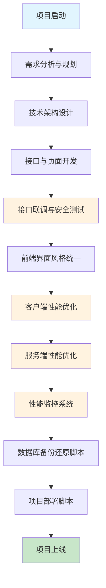
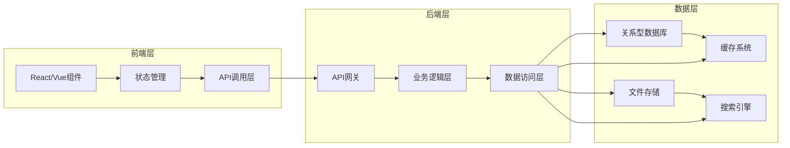
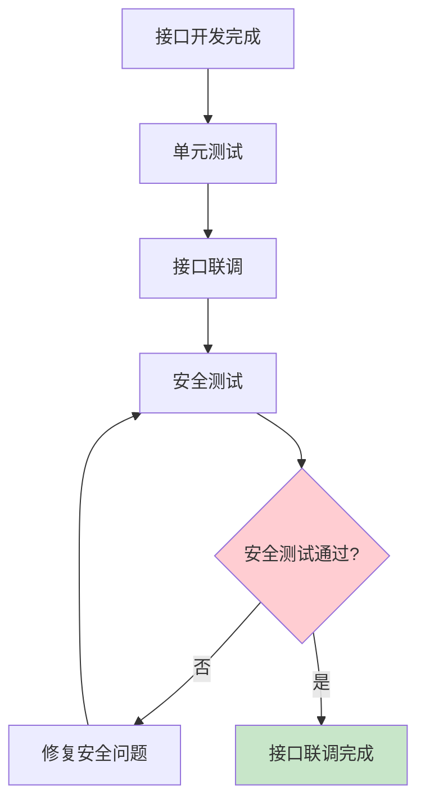
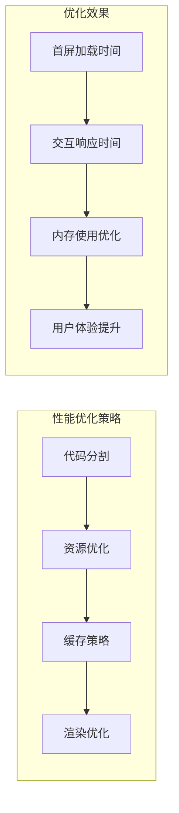
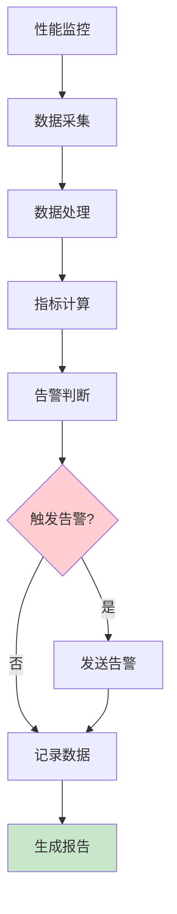
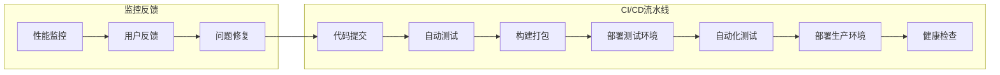

# AI开发完整产品实施流程指南

## 概述

本文档提供了AI开发完整产品的系统化实施流程，确保项目从规划到部署的每个阶段都有清晰的指导原则和最佳实践。

## 核心原则

- **高内聚低耦合**：模块化设计，确保组件间依赖最小化
- **代码质量**：单个文件不超过500行，保持代码可维护性
- **渐进式确认**：每个阶段完成后进行确认，再进行下一阶段
- **版本管理**：完整的代码版本控制和变更追踪

## 实施流程图

## 详细实施步骤

### 1. 需求分析与规划阶段

#### 1.1 产品需求文档（PRD）
- **用户故事梳理**：明确目标用户群体和使用场景
- **功能需求定义**：核心功能、扩展功能、未来规划
- **非功能性需求**：性能、安全、可用性要求
- **验收标准**：每个功能的完成标准

#### 1.2 技术架构文档（TAD）
- **系统架构图**：整体架构设计
- **技术选型**：前端框架、后端技术、数据库选择
- **数据流设计**：数据流转和处理逻辑
- **安全架构**：认证授权、数据保护策略

### 2. 开发实施阶段

#### 2.1 接口与页面开发
- **API接口开发**：RESTful API设计，遵循OpenAPI规范
- **前端页面开发**：组件化开发，确保复用性
- **数据库设计**：表结构设计，索引优化
- **单元测试**：接口和组件的单元测试覆盖

#### 2.2 接口联调与安全测试
- **接口联调**：前后端接口对接测试
- **安全测试**：SQL注入、XSS、CSRF等安全漏洞检测
- **权限验证**：用户角色权限系统测试
- **数据验证**：输入输出数据格式验证

### 3. 界面与体验优化阶段

#### 3.1 前端界面风格统一
- **设计系统建立**：色彩、字体、间距规范
- **组件库开发**：可复用UI组件
- **响应式设计**：多设备适配
- **无障碍优化**：WCAG 2.1标准遵循

#### 3.2 客户端性能优化
- **代码分割**：按需加载，减少初始包大小
- **资源优化**：图片压缩、CDN加速
- **缓存策略**：浏览器缓存、Service Worker
- **渲染优化**：虚拟滚动、懒加载

### 4. 服务端性能优化阶段

#### 4.1 系统性能优化
- **数据库优化**：查询优化、索引优化、连接池
- **缓存策略**：Redis缓存、内存缓存
- **异步处理**：消息队列、任务调度
- **负载均衡**：水平扩展、负载分发

#### 4.2 性能监控系统
- **监控指标**：响应时间、吞吐量、错误率
- **告警机制**：性能阈值告警、异常告警
- **日志分析**：结构化日志、日志聚合
- **性能报告**：定期性能报告、趋势分析

### 5. 运维与部署阶段

#### 5.1 数据库备份还原脚本
- **自动备份**：定时备份策略
- **增量备份**：减少备份时间和存储空间
- **备份验证**：备份完整性检查
- **快速还原**：灾难恢复流程

#### 5.2 项目部署脚本
- **环境管理**：开发、测试、生产环境配置
- **自动化部署**：CI/CD流水线
- **回滚机制**：快速回滚到稳定版本
- **健康检查**：部署后服务健康状态检查

## 质量保证措施

### 代码质量检查
- **代码规范**：ESLint、Prettier配置
- **类型检查**：TypeScript严格模式
- **代码审查**：Pull Request审查流程
- **测试覆盖**：单元测试、集成测试覆盖率要求

### 版本管理策略
- **分支策略**：Git Flow或GitHub Flow
- **版本标签**：语义化版本控制
- **变更日志**：详细的变更记录
- **发布流程**：标准化的发布流程

## 风险管理

### 技术风险
- **技术选型风险**：评估技术成熟度和社区支持
- **性能风险**：性能瓶颈识别和预防
- **安全风险**：安全漏洞定期扫描和修复

### 项目风险
- **进度风险**：里程碑监控和调整
- **资源风险**：人力资源和基础设施保障
- **质量风险**：质量门禁和验收标准

## 成功指标

### 技术指标
- **性能指标**：响应时间 < 200ms，吞吐量 > 1000 QPS
- **质量指标**：测试覆盖率 > 80%，缺陷密度 < 1个/KLOC
- **安全指标**：安全漏洞数量为0，权限控制100%覆盖

### 业务指标
- **用户体验**：用户满意度 > 90%
- **系统可用性**：99.9%以上
- **业务价值**：功能完整度100%，用户需求满足度100%

## 总结

遵循本指南的AI开发完整产品实施流程，可以确保项目的高质量交付。关键成功因素包括：

1. **严格的阶段确认**：每个阶段完成后必须确认质量
2. **持续的质量改进**：性能优化和监控贯穿整个项目
3. **完善的运维体系**：自动化部署和监控保障系统稳定
4. **有效的风险管理**：提前识别和预防潜在风险

通过系统化的实施流程，可以显著提高项目成功率，降低开发风险，确保最终产品的质量和性能满足预期目标。
