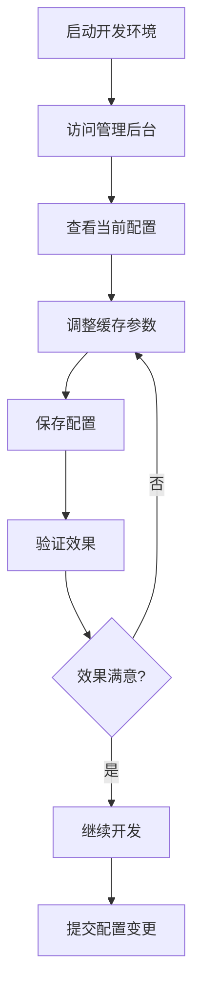
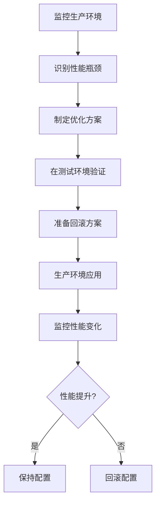

# 🎯 配置管理最佳实践指南

## 📋 目录
- [配置分类](#配置分类)
- [动态配置管理](#动态配置管理)
- [静态配置管理](#静态配置管理)
- [配置修改流程](#配置修改流程)
- [最佳实践](#最佳实践)
- [常见错误](#常见错误)

## 🔄 配置分类

### 1. 🔄 动态配置 (无需重启，立即生效)
```bash
# 缓存参数 - 可通过API动态修改
USER_CACHE_MAX_SIZE=100        # 缓存大小
USER_CACHE_TTL=300000          # 缓存TTL
USER_CACHE_CLEANUP_INTERVAL=300000  # 清理间隔

# 监控开关 - 支持热重载
CACHE_MONITOR_ENABLED=true
CACHE_MONITOR_VERBOSE=true
LOG_LEVEL=debug
DEBUG=true
```

**特点**:
- ✅ 修改后立即生效
- ✅ 自动持久化到数据库
- ✅ 支持运行时调整
- ✅ 无需重启服务

### 2. ⚠️ 静态配置 (需要重启才能生效)
```bash
# 环境配置
NODE_ENV=development
PORT=3001

# 数据库配置
SUPABASE_URL=...
SUPABASE_ANON_KEY=...

# 安全配置
JWT_SECRET=...
SESSION_SECRET=...

# 文件上传配置
UPLOAD_MAX_SIZE=10485760
UPLOAD_ALLOWED_TYPES=...
```

**特点**:
- ❌ 修改后需要重启服务
- ❌ 影响系统基础功能
- ❌ 涉及安全策略
- ❌ 需要谨慎修改

## 🚀 动态配置管理

### 管理方式

#### 1. 管理后台 (推荐)
```bash
# 访问地址
http://localhost:3000/admin/settings/cache

# 功能特点
- 可视化界面
- 实时预览效果
- 配置验证
- 一键重置
```

#### 2. API接口
```bash
# 获取配置
GET /api/admin/settings/cache

# 更新配置
PUT /api/admin/settings/cache
{
  "cacheType": "user",
  "maxSize": 1000,
  "defaultTTL": 1800000,
  "cleanupInterval": 300000
}

# 重置配置
POST /api/admin/settings/cache/reset
{
  "cacheType": "user"
}
```

#### 3. 通用接口
```bash
# 更新特定缓存配置
PUT /api/cache/configs/:instanceType

# 验证配置
POST /api/cache/configs/:instanceType/validate

# 重载实例
POST /api/cache/configs/:instanceType/reload
```

### 配置修改流程

#### 1. 开发环境调优
```bash
# 1. 启动项目
npm run dev

# 2. 访问管理后台
http://localhost:3000/admin/settings/cache

# 3. 调整缓存参数
- 用户缓存：100 → 200
- 内容缓存：200 → 500
- TTL：2分钟 → 5分钟

# 4. 保存配置
# 配置立即生效，无需重启
```

#### 2. 生产环境优化
```bash
# 1. 监控当前性能
- 查看缓存命中率
- 检查内存使用情况
- 分析响应时间

# 2. 根据负载调整
- 高并发：增加缓存大小
- 内存紧张：减少缓存大小
- 数据新鲜度：调整TTL

# 3. 验证效果
- 观察性能指标变化
- 确认无副作用
```

## ⚙️ 静态配置管理

### 修改流程

#### 1. 环境切换
```bash
# 开发 → 生产
# 1. 修改 .env 文件
NODE_ENV=production
LOG_LEVEL=info
DEBUG=false

# 2. 重启服务
npm run build
npm start

# 3. 验证配置
- 检查日志级别
- 确认调试功能禁用
- 验证安全设置
```

#### 2. 安全配置更新
```bash
# 1. 生成强密钥
openssl rand -hex 32

# 2. 更新 .env 文件
JWT_SECRET=新生成的强密钥
SESSION_SECRET=新生成的强密钥

# 3. 重启服务
npm restart

# 4. 测试认证
- 用户登录
- 会话管理
- API访问
```

### 配置备份策略

#### 1. 版本控制
```bash
# 1. 创建配置分支
git checkout -b config/development
git checkout -b config/production

# 2. 环境特定配置
# .env.development
# .env.production
# .env.test

# 3. 提交配置变更
git add .env*
git commit -m "Update environment configuration"
```

#### 2. 配置模板
```bash
# 1. 创建模板文件
cp .env .env.template

# 2. 移除敏感信息
# JWT_SECRET=your-secret-here
# SUPABASE_ANON_KEY=your-key-here

# 3. 添加说明注释
# 请根据实际环境填写以下配置
```

## 📊 配置修改流程

### 开发环境配置流程



### 生产环境配置流程



## 🎯 最佳实践

### 1. 配置分层管理

#### 环境配置层
```bash
# .env - 基础环境配置
NODE_ENV=development
PORT=3001
SUPABASE_URL=...
```

#### 功能配置层
```bash
# 通过API动态管理
- 缓存策略
- 监控设置
- 调试选项
```

#### 业务配置层
```bash
# 数据库中的配置
- 用户偏好
- 系统设置
- 业务规则
```

### 2. 配置验证策略

#### 开发环境验证
```bash
# 1. 功能测试
- 缓存命中/失效
- 性能监控
- 日志输出

# 2. 边界测试
- 最小/最大缓存大小
- 最短/最长TTL
- 内存使用极限
```

#### 生产环境验证
```bash
# 1. 性能测试
- 压力测试
- 内存监控
- 响应时间

# 2. 稳定性测试
- 长时间运行
- 故障恢复
- 配置持久化
```

### 3. 配置监控和告警

#### 关键指标监控
```bash
# 缓存性能
- 命中率 < 80% 告警
- 内存使用 > 80% 告警
- 响应时间 > 200ms 告警

# 系统健康
- 服务可用性
- 错误率
- 资源使用率
```

#### 配置变更追踪
```bash
# 1. 记录配置变更
- 变更时间
- 变更内容
- 变更原因
- 变更人员

# 2. 配置版本管理
- 版本号
- 变更日志
- 回滚点
```

## ❌ 常见错误

### 1. 配置修改错误

#### 错误示例
```bash
# ❌ 错误：直接修改 .env 中的缓存配置
USER_CACHE_MAX_SIZE=1000  # 修改后需要重启

# ✅ 正确：通过管理后台修改
# 1. 访问 /admin/settings/cache
# 2. 修改参数
# 3. 保存配置
```

#### 错误示例
```bash
# ❌ 错误：生产环境使用开发配置
NODE_ENV=development
DEBUG=true
LOG_LEVEL=debug

# ✅ 正确：生产环境配置
NODE_ENV=production
DEBUG=false
LOG_LEVEL=info
```

### 2. 配置管理错误

#### 错误示例
```bash
# ❌ 错误：没有备份就修改配置
# 直接修改生产环境配置

# ✅ 正确：配置修改流程
# 1. 备份当前配置
# 2. 在测试环境验证
# 3. 准备回滚方案
# 4. 生产环境应用
```

#### 错误示例
```bash
# ❌ 错误：配置修改后不验证
# 修改完配置就认为没问题

# ✅ 正确：配置验证流程
# 1. 功能验证
# 2. 性能验证
# 3. 稳定性验证
# 4. 监控确认
```

## 🔧 配置管理工具

### 1. 命令行工具

#### 配置查看
```bash
# 查看当前配置
npm run config:show

# 查看缓存状态
npm run cache:status

# 查看性能报告
npm run cache:performance
```

#### 配置修改
```bash
# 批量更新配置
npm run config:update -- --env=production

# 重置配置
npm run config:reset -- --type=user

# 配置验证
npm run config:validate -- --file=.env.production
```

### 2. 管理脚本

#### 环境切换脚本
```bash
#!/bin/bash
# scripts/switch-env.sh

ENV=$1
if [ "$ENV" = "production" ]; then
    cp .env.production .env
    echo "切换到生产环境"
elif [ "$ENV" = "development" ]; then
    cp .env.development .env
    echo "切换到开发环境"
else
    echo "用法: ./switch-env.sh [production|development]"
fi
```

#### 配置备份脚本
```bash
#!/bin/bash
# scripts/backup-config.sh

BACKUP_DIR="config-backups/$(date +%Y%m%d_%H%M%S)"
mkdir -p "$BACKUP_DIR"

cp .env "$BACKUP_DIR/"
cp -r deployment/configs "$BACKUP_DIR/"

echo "配置已备份到: $BACKUP_DIR"
```

## 📚 总结

### 配置管理原则

1. **分层管理**: 环境配置、功能配置、业务配置分离
2. **动态优先**: 优先使用动态配置，减少重启需求
3. **安全第一**: 生产环境配置必须经过验证
4. **监控驱动**: 基于性能指标调整配置
5. **版本控制**: 所有配置变更都要有记录

### 推荐工作流程

1. **开发阶段**: 使用管理后台动态调整缓存配置
2. **测试阶段**: 在测试环境验证配置效果
3. **部署阶段**: 使用脚本批量应用配置
4. **运行阶段**: 持续监控配置效果
5. **优化阶段**: 基于监控数据持续优化

通过遵循这些最佳实践，你可以高效、安全地管理项目配置，最大化动态配置的优势，最小化配置管理的风险！🚀
